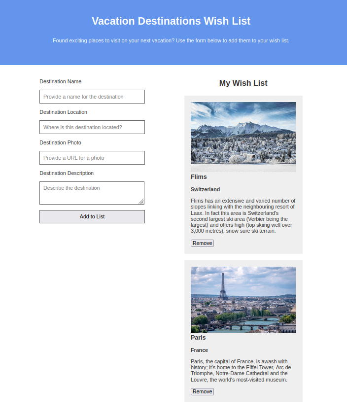

# Java Script Basics - Capstone Project

This repository contains the HTML, CSS and JavaScript files from the capstone project of the JavaScript Basics Course on coursera: https://www.coursera.org/learn/javascript-basics. The goal of the project was to build a small form that lets a user input some information about travel destinations. Then once submitted, the destinations would appear in a travel wish list to the right of the page. Each destination is displayed in a separate card, which can also be removed. Below is a screenshot of the finished page.

------

